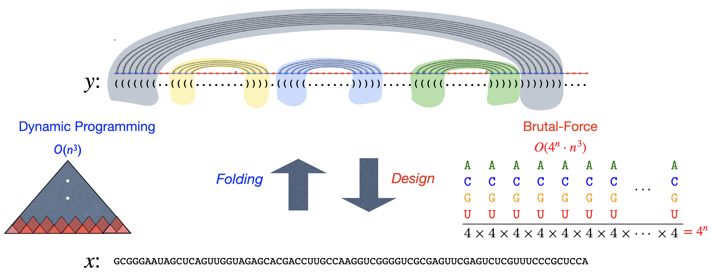
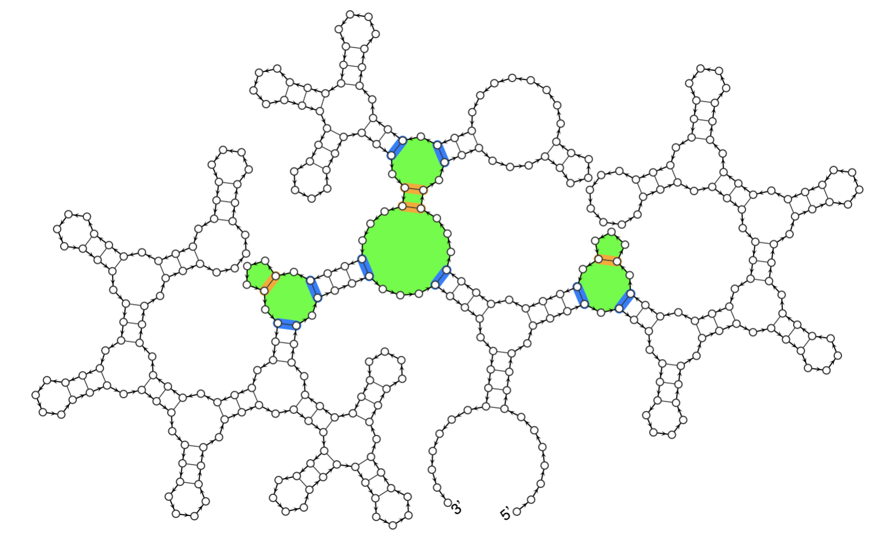

# Background

RNA design aims to find RNA sequences (`x`) that fold into a target secondary structure (`y`) under a specific RNA folding model, as illustrated in the figure below. For the widely adopted Turner RNA folding model, RNA folding can be computed in cubic time via dynamic programming. However, the search space of sequences is exponentially large. As a result, the RNA design problem is considered NP-hard.

## Undesignable Structure

Not all RNA secondary structures are computationally designable under the **Minimum Free Energy (MFE)** criterion—that is, for some structures y, no RNA sequence x will fold into y as its MFE structure. While exhaustively enumerating all possible sequences to prove y is undesignable is infeasible, one practical approach is to identify one or more <em>rival structures</em> that are energetically favored over y across all possible sequences.

This is feasible because when a rival structure is similar to the target structure, the energy difference is often determined by a few critical nucleotides at sparse positions. The figure below illustrates an undesignable target structure from the Eterna100 benchmark, along with its corresponding (single) rival structure identified by the RIGENDE algorithm [1].

## Undesignable Motif

While rival structures can provide evidence of undesignability at the whole-structure level, they offer limited interpretability. In practice, undesignability often originates from specific local regions or structural motifs. Identifying the smallest such regions—called <em>minimal undesignable motifs</em>—can provide insight into why a structure resists design. This interpretability enhances both understanding and potential reuse in RNA design workflows.

The figure below shows an example from Eterna100 with three highlighted minimal undesignable motifs, identified by the FastMotif algorithm [1].

## References

[1] Scalable and Interpretable Identification of Minimal Undesignable RNA Structure Motifs with Rotational
by T. Zhou, A. Malik, W. Y. Tang, D. H. Mathews, and L. Huang. **Proceedings of RECOMB 2025**.
Invariance, LNCS, Springer. \
[2] Undesignable RNA Structure Identification via Rival Structure Generation and Structure Decomposition, by
T. Zhou, W. Y. Tang, D. H. Mathews, and L. Huang. **Proceedings of RECOMB 2024**, LNCS 14758, Springer.